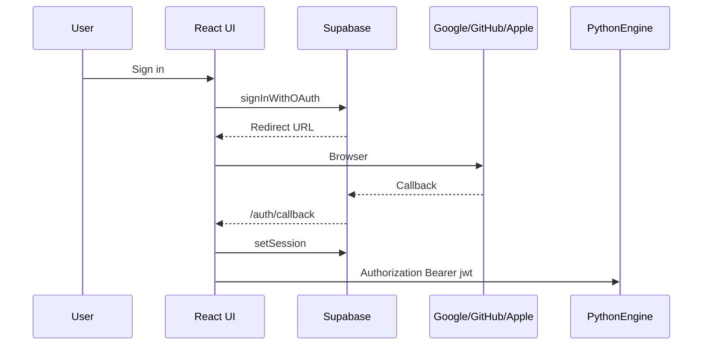

# Authentication

Supabase instance at `https://db.matrxserver.com` (Matrx Main). Desktop uses **publishable key** + user JWT — never service role, never `SUPABASE_JWT_SECRET` on the client or engine. External-connection rules: [CLAUDE.md](../../CLAUDE.md).

---

## OAuth flow (desktop)



**Redirect URLs** (Supabase Dashboard → Auth → URL Configuration):

```
http://localhost:1420/auth/callback
tauri://localhost/auth/callback
```

---

## Token handling

- Session in `localStorage` (`@supabase/supabase-js`)
- Engine calls: `EngineAPI.setTokenProvider()` → `Authorization: Bearer <jwt>`
- Engine validates JWT for cloud-sync features
- Remote scraper validates JWT via JWKS

---

## `/extension/*` JWT posture (local engine)

No server-side signing secret on the user's machine. Logic: `app/api/extension_auth.py`.

| Token type | Validation |
|------------|------------|
| RS256 / ES256 | JWKS fetch when `SUPABASE_URL` set; verify sig, iss, exp |
| HS256 / no JWKS | Bearer-presence on loopback only — trust boundary is OS user |

Boot logs active posture: `[extension_auth]`. Rationale: [/Users/armanisadeghi/code/common-docs/systems/clients/extension/CHANNELS.md](/Users/armanisadeghi/code/common-docs/systems/clients/extension/CHANNELS.md).

Extension command surface: [/Users/armanisadeghi/code/common-docs/systems/clients/extension/CHANNELS.md](/Users/armanisadeghi/code/common-docs/systems/clients/extension/CHANNELS.md).
