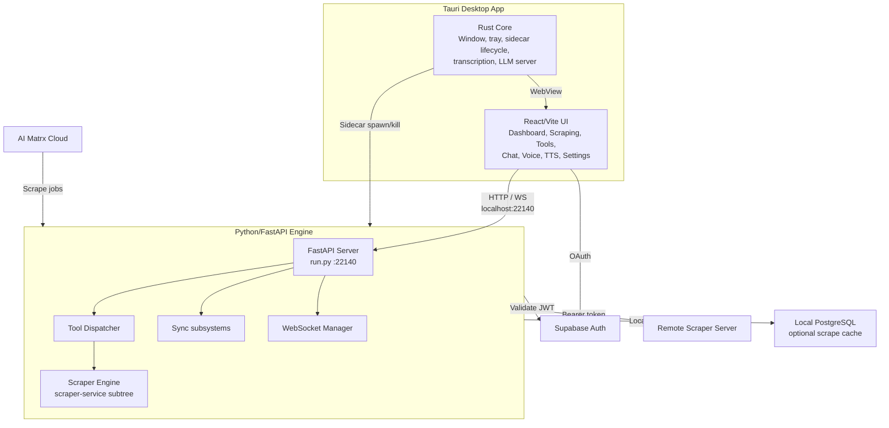

# Overview

Matrx Local is the companion desktop app for **AI Matrx**. It runs on the user's machine and exposes a tool-based API (REST + WebSocket) that cloud apps and agents use for filesystem, shell, browser, clipboard, hardware, residential IP, scraping, and local AI (llama-server, optional diffusers, Kokoro TTS).

---

## High-level architecture

---

## Connection paths

| From | To | Transport |
|------|-----|-----------|
| React UI | Python engine | HTTP/WS on loopback (`22140–22159`) |
| React UI | Supabase | Direct (`supabase-js`) — auth, cloud data |
| React UI | AIDream server | Direct HTTPS — cloud models/agents |
| Engine | Remote scraper | `scraper.app.matrxserver.com` |
| Engine | Local Postgres | Optional `DATABASE_URL` scrape cache |
| matrx-extend | Engine | `/extension/rpc`, `/extension/ws` |
| UI | Local SQLite | Via engine only (`~/.matrx/matrx.db`) |

Rust `invoke` paths (Whisper, wake word, llama-server, Rust downloads) bypass HTTP — see [desktop-tauri.md](./desktop-tauri.md).

---

## Request flow

1. User interacts with React in the Tauri WebView.
2. React calls the Python engine at `localhost:22140` (REST or WebSocket).
3. FastAPI dispatches to a tool handler or service route.
4. Result returns on the same transport.

**Production:** Tauri spawns the Python engine as a managed sidecar. **Development:** engine runs standalone (`uv run python run.py`).

Process ownership and shutdown: [lifecycle-ownership.md](./lifecycle-ownership.md).
